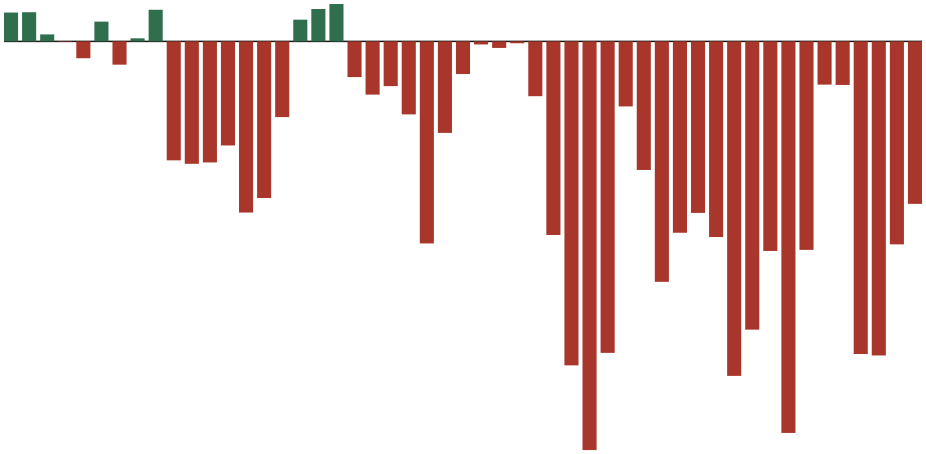
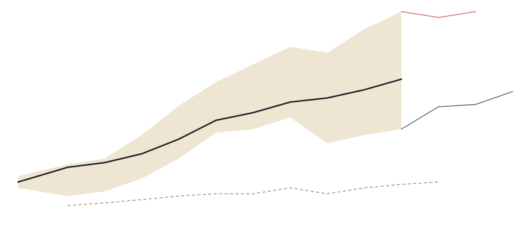



[Tell me the full story →](scrollytelling.html){: .alt-format}

# Financialization, 1975–2025

### A Tale In Three Acts

These three panels started by diving into stock buybacks at market
scale: where they came from as a corporate practice and how broadly they
occur in US equities today. Since the SEC adopted Rule 10b-18 in 1982,
American nonfinancial corporations have retired a cumulative $12.4
trillion in equity (2025 dollars) &mdash; [a half-century structural shift
from net issuance to persistent net
retirement](net-equity-issuance.html).

Panel II zooms out to contextualize the empirical basis of wealth
concentration. Five independent methodologies disagree on the magnitude,
but not the direction: the top-1% share of U.S. household wealth has
risen from roughly 24% in 1985 to 30&ndash;38% by the mid-2020s, depending on
whose estimates you trust. [The question is *how much* &mdash; never
*whether*](wealth_concentration.html).

Panel III connects these observations by exploring how stock buybacks
have reshaped corporate cash flows and, through the incidence of share
ownership, drive wealth concentration over the same period. In 1982 the
American public corporation was a machine for turning revenue into
productive capacity; by 2024 it is a machine for turning revenue &mdash; and
borrowed money &mdash; [into share price](where-the-money-went.html).

